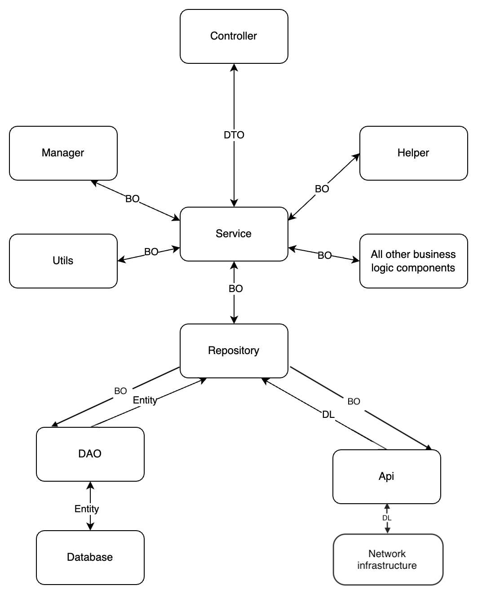

# PortionWise-Backend

This playground project demonstrates a clean architecture implementation for a C# .NET backend with embedded Sqlite. 

The project structure follows the principles of clean architecture, ensuring the separation of concerns and enhancing maintainability and testability. The main components of this architecture are Controllers, Services, Repositories, Data Access Objects (DAOs), API, and different data models such as DTO, BO, Entity, and DL.

## Project Structure

The project is organized into several layers, each responsible for a specific part of the application's functionality:

- **Controllers**: Handle HTTP requests and responses. They are responsible for receiving user input and returning the appropriate data.

- **Services**: Apply business logic. They are responsible for processing data received from controllers and communicating with repositories.

- **Repositories**: Provide an abstraction layer over the data access layer. They are responsible for communicating with the data sources and handling caching logic.

- **Data Access Objects (DAOs)**: Interact directly with the database. They are responsible for executing SQL queries and performing CRUD operations on the data.

- **APIs**: Interact with the network infrastructure They are responsible for handling external API interactions.


## Data Models
- **Data Transfer Objects (DTOs)** DTOs are used to transfer data between server and client over the network. They typically contain only the data required for a specific operation and do not include any business logic.
  
- **Business Objects (BOs)** BOs represent the business logic and rules. They may contain methods and properties that implement business logic in addition to the data.
  
- **Entities** Entities represent the data structure as it is stored in the database. They are used by the DAOs and typically map directly to database tables.

- **Data Layer (DL)** DL models are used for API requests. They encapsulate the data sent to and received from external APIs, ensuring that the application's internal data structures remain decoupled from the external service contracts.

The following image indicates the data flow between layers and components



## Getting Started

### Prerequisites

- .NET SDK 8.0

### Installation

1. Clone the repository
2. Restore the dependencies:

    ```sh
    dotnet restore
    ```
3. Run the application:

    ```sh
    cd PortionWise && dotnet run
    ```
4. open `http://localhost:5290/swagger/index.html` in the browser to access swagger.

## What's next
- Add unit tests
- Add API and database caching demo